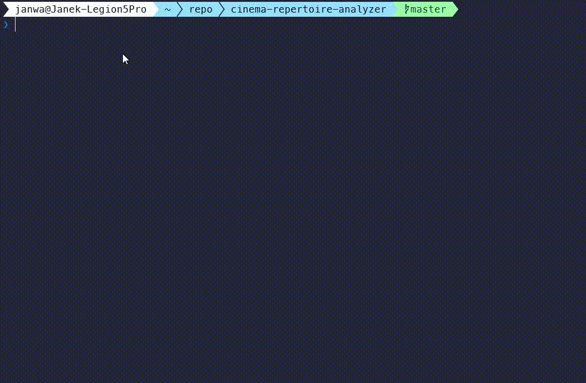

# Cinema Repertoire Analyzer



Scraper repertuarów kin, przygotowany obecnie dla Cinema City i gotowy na
rozszerzanie o kolejne sieci. Wyniki są pokazywane wraz z oceną i
streszczeniem filmu z TMDB.

## Wymagania

- uv
- python 3.14
- (opcjonalnie) make

## Instalacja

```shell
uv sync
```

Przy pierwszym uruchomieniu Playwright może pobrać przeglądarkę.

## Konfiguracja

Aplikacja zapisuje konfigurację w pliku `config.ini` w katalogu głównym repo.
Przy pierwszym uruchomieniu uruchomi się interaktywny kreator:

- pobierze listy lokali dla wszystkich obsługiwanych sieci z widocznym postępem
- pozwoli wybrać domyślną sieć, lokal, datę repertuaru, poziom logowania i plik bazy
- zapyta o opcjonalny token TMDB

Aby uruchomić kreator ponownie:

```shell
uv run app configure
```

## Uruchomienie

```shell
uv run app repertoire
uv run app repertoire bemowo 2024-12-06
uv run app repertoire --chain cinema-city
uv run app venues list
uv run app venues update
uv run app venues search manufaktura
```

Polecenia nadal przyjmują jawne `--chain`, ale gdy go pominiesz, aplikacja użyje
domyślnej sieci z `config.ini`.

## Testy

Komendy do uruchamiania testów wybiórczo znajdują się w `Makefile`.

```shell
uv run pytest tests
```
